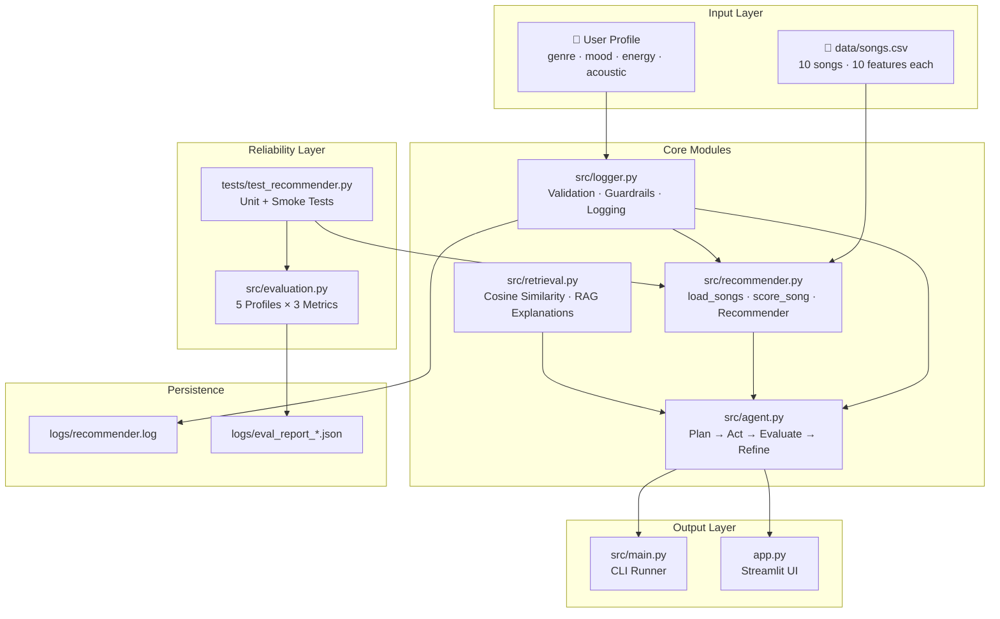
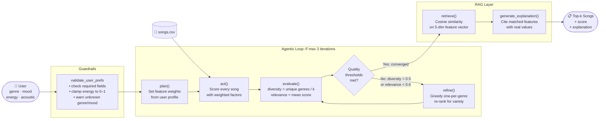
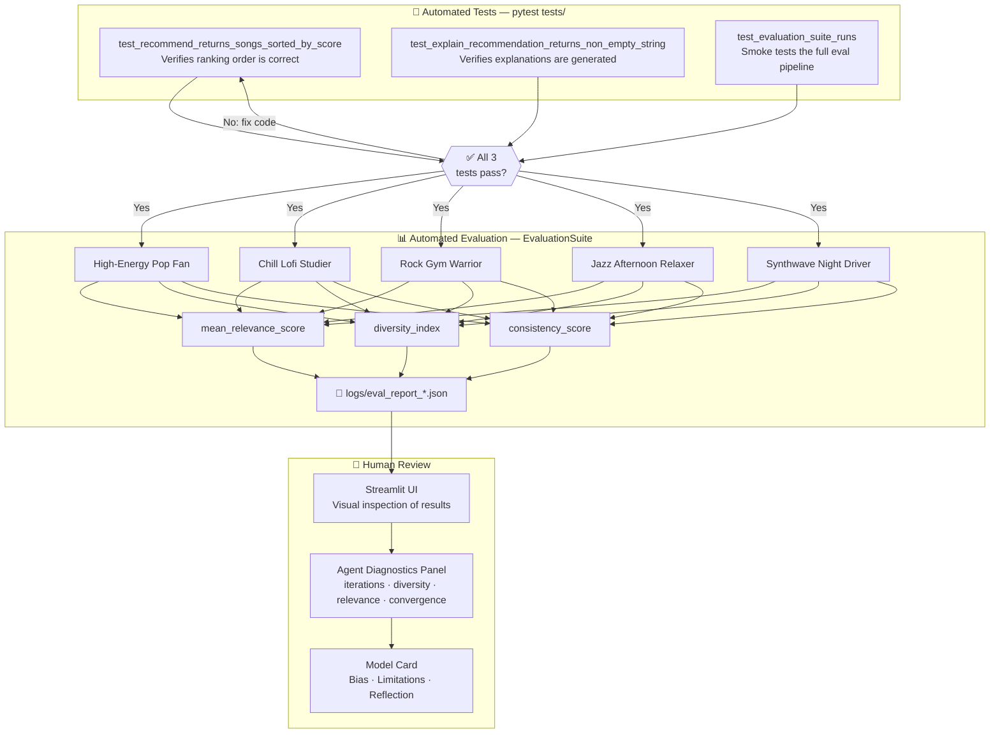

# VibeFinder — System Architecture

---

## Diagram 1: System Component Map

Shows every module, what it does, and how they depend on each other.

---

## Diagram 2: Data Flow

Traces a single request from user input all the way to ranked recommendations.

---

## Diagram 3: Human & Testing Touchpoints

Shows exactly where automated tests, the evaluation harness, and human review fit in the system.

---

## Component Responsibilities Summary

| Module | Role | AI Pattern |
|--------|------|-----------|
| `src/logger.py` | Validates input, logs all activity, skips bad data | Guardrails |
| `src/recommender.py` | Loads songs, scores each against user profile | Core scoring |
| `src/retrieval.py` | Cosine similarity search + feature-cited explanations | RAG |
| `src/agent.py` | Self-correcting loop: plan → act → evaluate → refine | Agentic Workflow |
| `src/evaluation.py` | Runs 5 profiles, measures 3 metrics, saves JSON report | Reliability Testing |
| `app.py` | Interactive UI with agent diagnostics panel | Human-in-the-loop |
| `tests/test_recommender.py` | Automated correctness checks | Reliability Testing |
